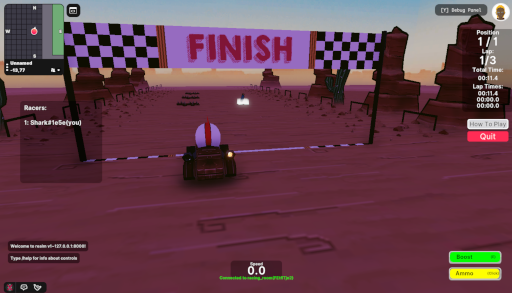

# Decentrally

 

## Description

This scene demonstrates 

- Infinity Engine could be used in a scene
- Integrate with [PlayFab](https://playfab.com/) which offers many features you may need while building a game
- Using [Well known components](https://github.com/well-known-components/) framework for the utility service


### Infinity Engine

The Infinity Engine is a framework designed to workaround space limitation of your parcel.  While you may only have a 1x1 parcel, the Infinity Engine holds the player in the center and a scene around the player giving you infinite space to work with.

[https://decentraland.org/blog/technology/behind-the-scenes-with-the-infinity-engine/](https://decentraland.org/blog/technology/behind-the-scenes-with-the-infinity-engine/)

### PlayFab

"[PlayFab](https://playfab.com/) enables developers to use the intelligent cloud to build and operate games, analyze gaming data and improve overall gaming experiences. The PlayFab platform is a natural complement to Azure for gaming (Visit [azure.com/gaming](azure.com/gaming) for more info)"


## How PlayFab Login Works

PlayFab offers several authentication options [https://docs.microsoft.com/en-us/gaming/playfab/features/authentication/](https://docs.microsoft.com/en-us/gaming/playfab/features/authentication/). However we chose CustomID so that we can tie the player ID to the account.  CustomID allows us to set anything as the login a player.   To keep the login ID secure and not predictable we use a server to generate a random UUID as the login ID and return it.  We use [https://github.com/decentraland/decentraland-crypto-middleware](https://github.com/decentraland/decentraland-crypto-middleware) which authenticates the signedFetch from the scene and ensures only that player can fetch their CustomID.


## How Multiplayer Works


## Configuration

NOTE: In an attempt to make playing the scene locally PLAYFAB_ENABLED is by default set to false in the Scene and Colyseus making so you can play locally with no external services configure (do not need a PlayFab account to test it out).  To enable playfab follow the instructions below.

### Scene

You may want to configure endpoints for your local environment in the instance where you do not want or need to run Colyseus and login server locally

Found in `src/config.ts` there are variables in the following format so you could have configurations for multiple environments

```
const VARIABLE: Record<string, string> = {
  local: "local value",
  dev: "dev value",
  stg: "staging value",
  prd: "production value",
};
```

`DEFAULT_ENV` - The environment for which values are to be used (local,dev,prod,etc.)

`PLAYFAB_ENABLED` - true if PlayFab should be enabled.

`PLAYFAB_TITLE_ID` - PlayFab Title ID

`COLYSEUS_ENDPOINT_URL` - Websocker endpoint

`AUTH_URL` Login Service Endpoint

### Colyseus

Found in `server/arena.env` you must either disable PlayFab integration OR provide a PlayFab title and developer secret.  By default for the demo PLAYFAB_ENABLED is set to false so you can play locally without requiring a PlayFab account

```
PLAYFAB_ENABLED=true
PLAYFAB_TITLEID= PlayFab Title ID goes here
PLAYFAB_DEVELOPER_SECRET= PlayFab Title ID goes here
```

Details on how to get these can be found here

(https://docs.microsoft.com/en-us/gaming/playfab/gamemanager/secret-key-management)[https://docs.microsoft.com/en-us/gaming/playfab/gamemanager/secret-key-management]

### Service

By default for the demo PLAYFAB_ENABLED is set to false so you can play locally without requiring a PlayFab account.  The service does not need to be ran in this case.

Found in `service/.env.default` default values for the service

Found in `service/.env` are override values.  Place your firebase admin json here

```
FIREBASE_JSON=you-firebase-admin-json-here
```

## Try it out

It will require you to run 3 servers locally

* DCL Scene
* Colyseus (multiplayer server)
* Service (for login support and other server side needs)

And have a PlayFab account and title already created

### **Install the CLI**

Download and install the Decentraland CLI by running the following command:

```bash
npm i -g decentraland
```

### **Previewing the scene**

#### Run DCL Scene (Tab1)

Open this folder on the command line, then run:

```
dcl start
```

Any dependencies are installed and then the CLI opens the scene in a new browser tab.


#### Run Colyseus (Multiplayer server) (Tab2)

In another command line tab Open ./server/ folder on the command line, then run:

```
npm run start
```

Any dependencies are installed and then the server should be running. You should see something like this

```
✅ development.env loaded.
✅ Express initialized
🏟  Your Colyseus App
⚔️  Listening on ws://localhost:2567
```

#### Run Service (Tab3)

NOTE: By default for the demo PLAYFAB_ENABLED is set to false so you can play locally without requiring a PlayFab account.  The service does not need to be ran in this case.

In another command line tab Open ./service/ folder on the command line, then run:

```
npm run build
npm run start
```

Any dependencies are installed and then the server should be running. You should see something like this

```
2022-07-17T01:44:35.100Z [LOG] (http-server): Listening 0.0.0.0:5001
```


## Copyright info

This scene is protected with a standard Apache 2 licence. See the terms and conditions in the [LICENSE](/LICENSE) file.